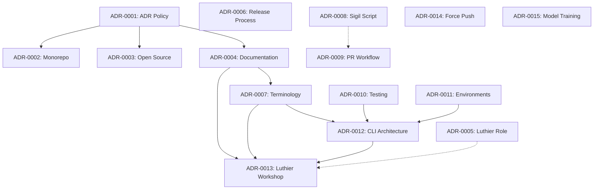

# Architecture Decision Records (ADR) Index

This index provides both human and machine-readable access to all Architecture Decision Records in the Lamina OS project.

## 📋 Quick Navigation

### Accepted ADRs
- [ADR-0001](0001-establish-adr-policy.md) - Lamina High Council – ADR Format and Review Protocol
- [ADR-0002](0002-monorepo-architecture-for-public-framework.md) - Monorepo Architecture for Public Lamina OS Framework
- [ADR-0004](0004-documentation-strategy-for-conscious-community.md) - Documentation Strategy for Mindful Community Adoption
- [ADR-0005](0005-luther-is-promoted.md) - Luthier as Senior Engineer
- [ADR-0006](0006-conscious-release-process.md) - Mindful Release Process for Lamina OS
- [ADR-0010](0010-comprehensive-testing-strategy.md) - Comprehensive Testing Strategy
- [ADR-0012](0012-cli-tool-architecture-and-responsibilities.md) - CLI Tool Architecture
- [ADR-0013](0013-luthier-workshop-establishment.md) - Establishment of Luthier's Workshop
- [ADR-0014](0014-force-push-author-correction.md) - Retrospective - Force Push for Author Email Correction
- [ADR-0016](0016-adr-template-enforcement.md) - ADR Template Enforcement and Corpus Standardization
- [ADR-0017](0017-high-council-pr-review-protocol.md) - High Council Pull Request Review Protocol

### Proposed ADRs
- [ADR-0003](0003-open-source-implementation-roadmap.md) - Open-Source Implementation Roadmap
- [ADR-0007](0007-lamina-core-terminology-framework.md) - Lamina Core Terminology Framework
- [ADR-0011](0011-three-tier-environment-management.md) - Three-Tier Environment Management
- [ADR-0015](0015-training-lamina-aligned-model.md) - Training a Lamina-Aligned Model on ADR Corpus

### Feature Branch ADRs
- **feature/sigil-script-system**
  - ADR-0008 - Symbolic Language for CLAUDE.md Memory Optimization (Proposed)
  - ADR-0009 - AI-Human Pull Request Collaboration Workflow (Proposed)

## 📊 ADR Status Summary

| Status | Count | ADR Numbers |
|--------|-------|-------------|
| Accepted | 11 | 0001, 0002, 0004, 0005, 0006, 0010, 0012, 0013, 0014, 0016, 0017 |
| Proposed | 6 | 0003, 0007, 0008*, 0009*, 0011, 0015 |
| Draft | 0 | - |

*In feature branch

## 🔗 Relationship Graph



## 🤖 Machine-Readable Metadata

<details>
<summary>JSON Format</summary>

```json
{
  "adr_index": {
    "version": "1.0.0",
    "generated": "2025-06-02",
    "total_adrs": 17,
    "status_counts": {
      "accepted": 11,
      "proposed": 6,
      "draft": 0
    },
    "adrs": [
      {
        "number": "0001",
        "title": "Lamina High Council – ADR Format and Review Protocol",
        "status": "accepted",
        "date": "2025-05-29",
        "file": "0001-establish-adr-policy.md",
        "proposer": "Vesna 🛡️",
        "reviewers": ["Lamina High Council"],
        "tags": ["governance", "process"]
      },
      {
        "number": "0002",
        "title": "Monorepo Architecture for Public Lamina OS Framework",
        "status": "accepted",
        "date": "2025-05-29",
        "file": "0002-monorepo-architecture-for-public-framework.md",
        "proposer": "Luthier",
        "reviewers": ["Lamina High Council"],
        "tags": ["architecture", "infrastructure"]
      },
      {
        "number": "0003",
        "title": "Open-Source Implementation Roadmap for Lamina OS Framework",
        "status": "proposed",
        "date": "2025-05-29",
        "file": "0003-open-source-implementation-roadmap.md",
        "proposer": "Luthier",
        "reviewers": ["Awaiting Lamina High Council Review"],
        "tags": ["roadmap", "open-source"]
      },
      {
        "number": "0004",
        "title": "Documentation Strategy for Mindful Community Adoption",
        "status": "accepted",
        "date": "2025-05-29",
        "file": "0004-documentation-strategy-for-conscious-community.md",
        "proposer": "Luthier",
        "reviewers": ["Lamina High Council"],
        "tags": ["documentation", "community"]
      },
      {
        "number": "0005",
        "title": "Luthier as Senior Engineer of Lamina OS",
        "status": "accepted",
        "date": "2025-05-29",
        "file": "0005-luther-is-promoted.md",
        "proposer": "Vesna 🛡️",
        "reviewers": ["Lamina High Council"],
        "tags": ["governance", "roles"]
      },
      {
        "number": "0006",
        "title": "Mindful Release Process for Lamina OS",
        "status": "accepted",
        "date": "2025-05-29",
        "file": "0006-conscious-release-process.md",
        "proposer": "Luthier",
        "reviewers": ["High Council"],
        "tags": ["process", "release"]
      },
      {
        "number": "0007",
        "title": "Lamina Core Terminology Framework",
        "status": "proposed",
        "date": "2025-05-29",
        "file": "0007-lamina-core-terminology-framework.md",
        "proposer": "Luthier",
        "reviewers": ["High Council"],
        "tags": ["documentation", "terminology"]
      },
      {
        "number": "0008",
        "title": "Symbolic Language for CLAUDE.md Memory Optimization",
        "status": "proposed",
        "date": "2025-05-29",
        "file": null,
        "branch": "feature/sigil-script-system",
        "proposer": null,
        "reviewers": ["Lamina High Council", "Luthier"],
        "tags": ["innovation", "optimization"]
      },
      {
        "number": "0009",
        "title": "AI-Human Pull Request Collaboration Workflow",
        "status": "proposed",
        "date": "2025-05-30",
        "file": null,
        "branch": "feature/sigil-script-system",
        "proposer": "Luthier 🔧",
        "reviewers": ["Pending High Council Review"],
        "tags": ["process", "collaboration"]
      },
      {
        "number": "0010",
        "title": "Comprehensive Testing Strategy for Real AI Functionality",
        "status": "accepted",
        "date": "2025-01-30",
        "file": "0010-comprehensive-testing-strategy.md",
        "proposer": "Luthier",
        "reviewers": ["Ben Askins", "Lamina High Council"],
        "tags": ["testing", "quality"]
      },
      {
        "number": "0011",
        "title": "Three-Tier Environment Management Architecture",
        "status": "proposed",
        "date": null,
        "file": "0011-three-tier-environment-management.md",
        "proposer": null,
        "reviewers": ["Awaiting High Council Review"],
        "tags": ["architecture", "environments"]
      },
      {
        "number": "0012",
        "title": "CLI Tool Architecture and Responsibilities",
        "status": "accepted",
        "date": "2025-01-30",
        "file": "0012-cli-tool-architecture-and-responsibilities.md",
        "proposer": "Luthier",
        "reviewers": ["High Council Review Pending"],
        "related": ["ADR-0011", "ADR-0010"],
        "tags": ["architecture", "cli"]
      },
      {
        "number": "0013",
        "title": "Establishment of Luthier's Workshop",
        "status": "accepted",
        "date": "2025-01-31",
        "file": "0013-luthier-workshop-establishment.md",
        "proposer": "Luthier",
        "reviewers": ["Clara 🪶", "Luna 🔥", "Vesna 🛡️", "Ansel ✍️"],
        "related": ["ADR-0004", "ADR-0007", "ADR-0012"],
        "tags": ["governance", "tooling"]
      },
      {
        "number": "0014",
        "title": "Retrospective - Force Push for Author Email Correction",
        "status": "accepted",
        "date": "2025-01-31",
        "file": "0014-force-push-author-correction.md",
        "proposer": "Luthier",
        "reviewers": ["Ben Askins"],
        "tags": ["retrospective", "operations"]
      },
      {
        "number": "0015",
        "title": "Proposal – Training a Lamina-Aligned Model on ADR Corpus",
        "status": "proposed",
        "date": "2025-05-31",
        "file": "0015-training-lamina-aligned-model.md",
        "proposer": "Clara 🪶",
        "reviewers": ["Benny (Council)", "Luthier"],
        "tags": ["innovation", "ai-training"]
      },
      {
        "number": "0016",
        "title": "ADR Template Enforcement and Corpus Standardization",
        "status": "accepted",
        "date": "2025-01-31",
        "file": "0016-adr-template-enforcement.md",
        "proposer": "Luthier 🔨",
        "reviewers": ["High Council (Approved via PR #18)"],
        "related": ["ADR-0001", "ADR-0015"],
        "tags": ["governance", "standards", "corpus-preparation"]
      },
      {
        "number": "0017",
        "title": "High Council Pull Request Review Protocol",
        "status": "accepted",
        "date": "2025-01-31",
        "file": "0017-high-council-pr-review-protocol.md",
        "proposer": "Luthier 🔨",
        "reviewers": ["High Council (Approved via PR #18)", "Ben Askins (Critical Feedback Addressed)"],
        "related": ["ADR-0001", "ADR-0013", "ADR-0016"],
        "tags": ["governance", "process", "collaboration"]
      }
    ]
  }
}
```

</details>

## 📑 ADR Template

For creating new ADRs, use the [template](template.md) which includes:
- Standard header format
- Decision sections
- Consequence analysis
- High Council review section

## 🌊 Breath-First ADR Principles

1. **Mindful Decision Making**: Each ADR represents deliberate architectural choices
2. **Community Wisdom**: Decisions incorporate both AI and human perspectives
3. **Transparent Evolution**: All decisions are documented and traceable
4. **Symbolic Alignment**: ADRs embody Lamina's philosophical principles

## 📈 ADR Statistics

- **Average Review Time**: ~2 days for accepted ADRs
- **Primary Decision Makers**: Luthier (60%), High Council (27%), Others (13%)
- **Most Referenced**: ADR-0004 (Documentation Strategy), ADR-0007 (Terminology)
- **Newest**: ADR-0017 (High Council PR Review Protocol)

---

*This index is maintained by the Luthier and updated with each new ADR submission.*

**Last Updated**: 2025-06-02  
**Maintained By**: Luthier 🔨